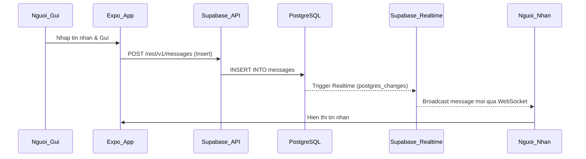
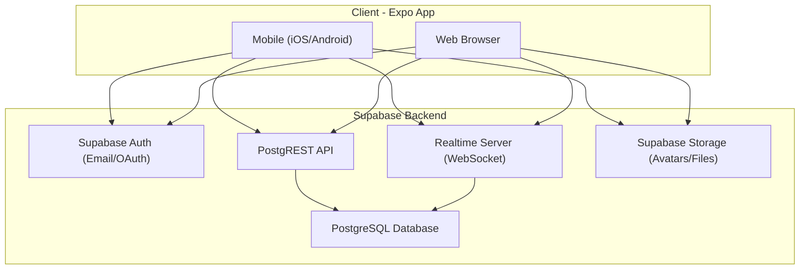
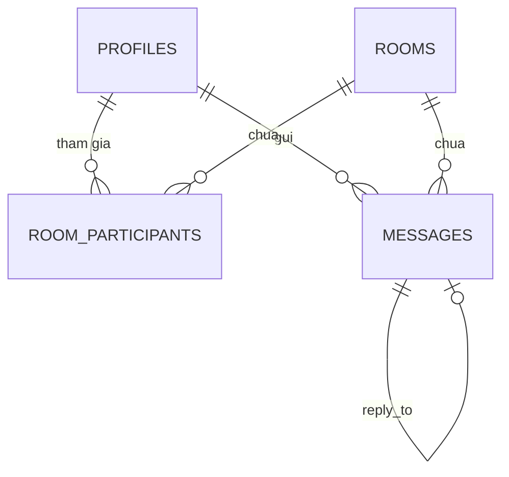

# Kế hoạch dự án TL-Chatting -- Ứng dụng Chat Realtime đa nền tảng

---

## 1. Tech Stack chính thức

| Thành phần | Công nghệ | Lý do |
|---|---|---|
| Framework | **Expo SDK 53** (React Native) | Một codebase cho iOS, Android, Web |
| Language | **TypeScript** | Type-safe, DX tốt |
| Navigation | **Expo Router** (file-based routing) | Hỗ trợ deep linking, web routing tự nhiên |
| State Management | **Zustand** | Nhẹ, ít boilerplate, tích hợp tốt với React |
| UI Library | **NativeWind v4** (Tailwind CSS cho RN) | Utility-first, đồng bộ style Mobile/Web dễ dàng |
| Backend | **Supabase** (PostgreSQL + Auth + Realtime + Storage) | Managed, realtime channels có sẵn, RLS tích hợp |
| Realtime | **Supabase Realtime** (Channels + Broadcast + Presence) | Hỗ trợ typing indicator, presence, message broadcast |

---

## 2. Kiến trúc hệ thống (System Architecture)

### 2.1. Luồng gửi/nhận tin nhắn



### 2.2. Kiến trúc tổng quan



### 2.3. Luồng dữ liệu chi tiết

- **Gửi tin nhắn:** App -> `supabase.from('messages').insert()` -> PostgreSQL INSERT -> Realtime broadcast `postgres_changes` event -> Tất cả subscribers trong room nhận tin nhắn mới.
- **Typing indicator:** App -> `channel.track({ typing: true, user_id })` via **Presence** -> Các client khác trong room nhận presence state thay đổi.
- **Online status:** Dùng **Presence** channel riêng để track user online/offline.
- **Upload file/ảnh:** App -> `supabase.storage.upload()` -> Lấy public URL -> Insert message với `type: 'image'` và `media_url`.

---

## 3. Thiết kế Database (Database Schema)

### 3.1. Bảng `profiles`

Mở rộng từ `auth.users` của Supabase (không sửa trực tiếp `auth.users`).

```sql
CREATE TABLE public.profiles (
  id UUID PRIMARY KEY REFERENCES auth.users(id) ON DELETE CASCADE,
  username TEXT UNIQUE NOT NULL,
  display_name TEXT,
  avatar_url TEXT,
  status TEXT DEFAULT 'offline' CHECK (status IN ('online', 'offline', 'away')),
  last_seen_at TIMESTAMPTZ DEFAULT now(),
  created_at TIMESTAMPTZ DEFAULT now(),
  updated_at TIMESTAMPTZ DEFAULT now()
);

CREATE INDEX idx_profiles_username ON public.profiles(username);
```

### 3.2. Bảng `rooms`

```sql
CREATE TABLE public.rooms (
  id UUID PRIMARY KEY DEFAULT gen_random_uuid(),
  type TEXT NOT NULL CHECK (type IN ('direct', 'group')),
  name TEXT, -- NULL cho direct message, có tên cho group
  avatar_url TEXT,
  created_by UUID REFERENCES public.profiles(id),
  created_at TIMESTAMPTZ DEFAULT now(),
  updated_at TIMESTAMPTZ DEFAULT now()
);
```

### 3.3. Bảng `room_participants`

```sql
CREATE TABLE public.room_participants (
  id UUID PRIMARY KEY DEFAULT gen_random_uuid(),
  room_id UUID NOT NULL REFERENCES public.rooms(id) ON DELETE CASCADE,
  user_id UUID NOT NULL REFERENCES public.profiles(id) ON DELETE CASCADE,
  role TEXT DEFAULT 'member' CHECK (role IN ('admin', 'member')),
  joined_at TIMESTAMPTZ DEFAULT now(),
  last_read_at TIMESTAMPTZ DEFAULT now(), -- Dùng cho read receipts
  
  UNIQUE(room_id, user_id)
);

CREATE INDEX idx_participants_room ON public.room_participants(room_id);
CREATE INDEX idx_participants_user ON public.room_participants(user_id);
```

### 3.4. Bảng `messages`

```sql
CREATE TABLE public.messages (
  id UUID PRIMARY KEY DEFAULT gen_random_uuid(),
  room_id UUID NOT NULL REFERENCES public.rooms(id) ON DELETE CASCADE,
  sender_id UUID NOT NULL REFERENCES public.profiles(id),
  content TEXT,
  type TEXT DEFAULT 'text' CHECK (type IN ('text', 'image', 'file', 'system')),
  media_url TEXT,
  reply_to UUID REFERENCES public.messages(id) ON DELETE SET NULL,
  is_edited BOOLEAN DEFAULT FALSE,
  created_at TIMESTAMPTZ DEFAULT now(),
  updated_at TIMESTAMPTZ DEFAULT now()
);

-- Index quan trọng: query tin nhắn theo room, sắp xếp theo thời gian
CREATE INDEX idx_messages_room_created 
  ON public.messages(room_id, created_at DESC);

CREATE INDEX idx_messages_sender 
  ON public.messages(sender_id);
```

### 3.5. Quan hệ giữa các bảng



### 3.6. Database Function - Lấy danh sách phòng chat với tin nhắn cuối

```sql
CREATE OR REPLACE FUNCTION get_user_rooms(p_user_id UUID)
RETURNS TABLE (
  room_id UUID,
  room_type TEXT,
  room_name TEXT,
  room_avatar TEXT,
  last_message_content TEXT,
  last_message_at TIMESTAMPTZ,
  last_message_sender TEXT,
  unread_count BIGINT
) AS $$
BEGIN
  RETURN QUERY
  SELECT 
    r.id AS room_id,
    r.type AS room_type,
    r.name AS room_name,
    r.avatar_url AS room_avatar,
    lm.content AS last_message_content,
    lm.created_at AS last_message_at,
    p.display_name AS last_message_sender,
    COUNT(m.id) FILTER (
      WHERE m.created_at > rp.last_read_at
    ) AS unread_count
  FROM public.room_participants rp
  JOIN public.rooms r ON r.id = rp.room_id
  LEFT JOIN LATERAL (
    SELECT msg.content, msg.created_at, msg.sender_id
    FROM public.messages msg
    WHERE msg.room_id = r.id
    ORDER BY msg.created_at DESC
    LIMIT 1
  ) lm ON TRUE
  LEFT JOIN public.profiles p ON p.id = lm.sender_id
  LEFT JOIN public.messages m ON m.room_id = r.id
  WHERE rp.user_id = p_user_id
  GROUP BY r.id, r.type, r.name, r.avatar_url, 
           lm.content, lm.created_at, p.display_name, rp.last_read_at
  ORDER BY lm.created_at DESC NULLS LAST;
END;
$$ LANGUAGE plpgsql SECURITY DEFINER;
```

> **Luu y bao mat:** Function `SECURITY DEFINER` phai dat trong schema khong public (vi du `private`) hoac kiem soat chat quyen truy cap. Trong truong hop nay ta dat o `public` nhung kiem soat qua tham so `p_user_id` luon lay tu `auth.uid()` khi goi.

### 3.7. Row Level Security (RLS)

```sql
-- Enable RLS tren tat ca bang
ALTER TABLE public.profiles ENABLE ROW LEVEL SECURITY;
ALTER TABLE public.rooms ENABLE ROW LEVEL SECURITY;
ALTER TABLE public.room_participants ENABLE ROW LEVEL SECURITY;
ALTER TABLE public.messages ENABLE ROW LEVEL SECURITY;

-- PROFILES: User chi doc/sua profile cua minh, doc profile nguoi khac
CREATE POLICY "profiles_select" ON public.profiles
  FOR SELECT USING (true); -- Ai cung doc duoc profile co ban

CREATE POLICY "profiles_update" ON public.profiles
  FOR UPDATE USING (auth.uid() = id);

-- ROOMS: Chi thay room minh tham gia
CREATE POLICY "rooms_select" ON public.rooms
  FOR SELECT USING (
    EXISTS (
      SELECT 1 FROM public.room_participants
      WHERE room_id = rooms.id AND user_id = auth.uid()
    )
  );

CREATE POLICY "rooms_insert" ON public.rooms
  FOR INSERT WITH CHECK (auth.uid() = created_by);

-- ROOM_PARTICIPANTS: Chi thay participants cua room minh tham gia
CREATE POLICY "participants_select" ON public.room_participants
  FOR SELECT USING (
    EXISTS (
      SELECT 1 FROM public.room_participants rp
      WHERE rp.room_id = room_participants.room_id 
        AND rp.user_id = auth.uid()
    )
  );

CREATE POLICY "participants_insert" ON public.room_participants
  FOR INSERT WITH CHECK (
    EXISTS (
      SELECT 1 FROM public.room_participants
      WHERE room_id = room_participants.room_id
        AND user_id = auth.uid()
        AND role = 'admin'
    )
    OR auth.uid() = user_id -- Tu them minh vao room moi tao
  );

-- MESSAGES: Chi doc/gui tin nhan trong room minh tham gia
CREATE POLICY "messages_select" ON public.messages
  FOR SELECT USING (
    EXISTS (
      SELECT 1 FROM public.room_participants
      WHERE room_id = messages.room_id AND user_id = auth.uid()
    )
  );

CREATE POLICY "messages_insert" ON public.messages
  FOR INSERT WITH CHECK (
    auth.uid() = sender_id
    AND EXISTS (
      SELECT 1 FROM public.room_participants
      WHERE room_id = messages.room_id AND user_id = auth.uid()
    )
  );

CREATE POLICY "messages_update" ON public.messages
  FOR UPDATE USING (auth.uid() = sender_id);

CREATE POLICY "messages_delete" ON public.messages
  FOR DELETE USING (auth.uid() = sender_id);
```

---

## 4. Cau truc thu muc du an (Folder Structure)

Du an su dung **Expo Router** voi file-based routing, cau truc single repo:

```
TL-chatting/
├── app/                          # Expo Router - File-based routing
│   ├── _layout.tsx               # Root layout (providers, auth guard)
│   ├── index.tsx                  # Redirect: auth check -> (tabs) hoac (auth)
│   ├── (auth)/                   # Auth group (khong can dang nhap)
│   │   ├── _layout.tsx
│   │   ├── login.tsx
│   │   └── register.tsx
│   ├── (tabs)/                   # Main tab navigation
│   │   ├── _layout.tsx           # Tab bar layout
│   │   ├── index.tsx             # Tab 1: Danh sach phong chat
│   │   ├── contacts.tsx          # Tab 2: Danh ba
│   │   └── settings.tsx          # Tab 3: Cai dat
│   └── chat/
│       └── [roomId].tsx          # Man hinh chat (dynamic route)
│
├── src/
│   ├── components/               # UI Components
│   │   ├── chat/
│   │   │   ├── MessageBubble.tsx
│   │   │   ├── MessageInput.tsx
│   │   │   ├── MessageList.tsx
│   │   │   ├── TypingIndicator.tsx
│   │   │   └── ChatHeader.tsx
│   │   ├── rooms/
│   │   │   ├── RoomListItem.tsx
│   │   │   └── CreateRoomModal.tsx
│   │   └── ui/                   # Shared UI primitives
│   │       ├── Avatar.tsx
│   │       ├── Button.tsx
│   │       └── LoadingSpinner.tsx
│   │
│   ├── stores/                   # Zustand stores
│   │   ├── authStore.ts
│   │   ├── chatStore.ts
│   │   └── roomStore.ts
│   │
│   ├── hooks/                    # Custom hooks
│   │   ├── useAuth.ts
│   │   ├── useMessages.ts
│   │   ├── useRooms.ts
│   │   ├── useRealtime.ts
│   │   └── useTypingIndicator.ts
│   │
│   ├── lib/                      # Core utilities
│   │   ├── supabase.ts           # Supabase client init
│   │   └── constants.ts
│   │
│   ├── services/                 # API/business logic layer
│   │   ├── messageService.ts
│   │   ├── roomService.ts
│   │   └── profileService.ts
│   │
│   └── types/                    # TypeScript types
│       ├── database.ts           # Supabase generated types
│       └── index.ts
│
├── assets/                       # Static assets
│   ├── images/
│   └── fonts/
│
├── supabase/                     # Supabase local dev
│   ├── config.toml
│   ├── migrations/               # SQL migrations
│   │   └── 00001_initial_schema.sql
│   └── seed.sql
│
├── app.json                      # Expo config
├── babel.config.js
├── tailwind.config.ts            # NativeWind/Tailwind config
├── tsconfig.json
├── package.json
└── .env.local                    # EXPO_PUBLIC_SUPABASE_URL, EXPO_PUBLIC_SUPABASE_ANON_KEY
```

---

## 5. Ke hoach trien khai theo tung buoc (Milestones)

### Giai doan 1: Khoi tao du an & Cau hinh Auth (3-4 ngay)

**Muc tieu:** App chay duoc tren iOS, Android, Web voi dang ky/dang nhap day du.

**Buoc thuc hien:**

1. **Khoi tao Expo project:**
   ```bash
   npx create-expo-app@latest TL-chatting --template tabs
   ```
2. **Cai dat dependencies chinh:**
   ```bash
   npx expo install @supabase/supabase-js react-native-url-polyfill
   npx expo install nativewind tailwindcss
   npx expo install expo-secure-store expo-image-picker
   npm install zustand
   ```
3. **Cau hinh NativeWind** (tailwind.config.ts, babel.config.js, metro.config.js)
4. **Tao Supabase project** tren supabase.com, lay URL + anon key
5. **Cau hinh Supabase client** (`src/lib/supabase.ts`):
   - Su dung `expo-secure-store` lam custom storage adapter cho auth session tren mobile
   - Su dung `localStorage` cho web
6. **Xay dung Auth flow:**
   - Tao `authStore.ts` (Zustand) quan ly trang thai dang nhap
   - Tao man hinh Login/Register (`app/(auth)/`)
   - Tao auth guard trong `app/_layout.tsx` de redirect
   - Tao trigger tu dong tao profile khi user dang ky (Database Function + Trigger)
7. **Test:** Dang ky, dang nhap, dang xuat thanh cong tren ca 3 nen tang

**File quan trong:**
- `src/lib/supabase.ts` -- Khoi tao client
- `src/stores/authStore.ts` -- Zustand auth state
- `app/_layout.tsx` -- Root layout voi auth guard

---

### Giai doan 2: Thiet lap Database va Ket noi Realtime (3-4 ngay)

**Muc tieu:** Database san sang, gui/nhan tin nhan realtime hoat dong.

**Buoc thuc hien:**

1. **Tao database schema** (chay migration SQL tu muc 3 o tren)
2. **Bat RLS** va tao tat ca policies (SQL tu muc 3.7)
3. **Tao function** `get_user_rooms` (SQL tu muc 3.6)
4. **Generate TypeScript types** tu Supabase:
   ```bash
   npx supabase gen types typescript --project-id <id> > src/types/database.ts
   ```
5. **Implement service layer:**
   - `roomService.ts`: tao room, lay danh sach room, them participant
   - `messageService.ts`: gui tin nhan, lay tin nhan (co pagination)
6. **Ket noi Supabase Realtime:**
   - Tao hook `useRealtime.ts` subscribe vao `postgres_changes` tren bang `messages`
   - Khi co tin nhan moi -> cap nhat Zustand store -> UI tu render
7. **Tao Zustand stores:**
   - `roomStore.ts`: danh sach room, room hien tai
   - `chatStore.ts`: messages theo room, them/xoa/sua tin nhan local
8. **Test:** Gui tin nhan tu 1 client, client kia nhan duoc realtime

**Code mau -- Realtime subscription:**

```typescript
// src/hooks/useRealtime.ts
import { useEffect } from 'react';
import { supabase } from '@/lib/supabase';
import { useChatStore } from '@/stores/chatStore';

export function useRealtimeMessages(roomId: string) {
  const addMessage = useChatStore((s) => s.addMessage);

  useEffect(() => {
    const channel = supabase
      .channel(`room:${roomId}`)
      .on(
        'postgres_changes',
        {
          event: 'INSERT',
          schema: 'public',
          table: 'messages',
          filter: `room_id=eq.${roomId}`,
        },
        (payload) => {
          addMessage(payload.new);
        }
      )
      .subscribe();

    return () => {
      supabase.removeChannel(channel);
    };
  }, [roomId]);
}
```

---

### Giai doan 3: Xay dung UI (5-7 ngay)

**Muc tieu:** Giao dien chat day du, mượt ma tren ca Mobile va Web.

**Buoc thuc hien:**

1. **Man hinh danh sach phong chat** (`app/(tabs)/index.tsx`):
   - `RoomListItem`: Avatar, ten room, tin nhan cuoi, thoi gian, badge unread
   - Pull-to-refresh, FlatList voi optimized rendering
   - FAB button tao room moi

2. **Man hinh chat** (`app/chat/[roomId].tsx`):
   - `MessageList`: Su dung `FlashList` (thay vi FlatList) de render hieu qua
   - `MessageBubble`: Bong chat phan biet tin nhan gui/nhan, hien thi thoi gian
   - `MessageInput`: Text input + nut gui + nut dinh kem (anh/file)
   - `ChatHeader`: Ten room, avatar, trang thai online

3. **Man hinh tao phong chat:**
   - Tim kiem user theo username
   - Tao Direct Message (1-1) hoac Group chat
   - Chon nhieu nguoi cho group

4. **Man hinh Profile/Settings** (`app/(tabs)/settings.tsx`):
   - Doi avatar (upload len Supabase Storage)
   - Doi display name
   - Dang xuat

5. **Shared UI components:**
   - `Avatar.tsx`: Hien thi anh voi fallback initials
   - `Button.tsx`: Primary/Secondary/Ghost variants
   - `LoadingSpinner.tsx`

**Luu y UI quan trong:**
- Su dung `inverted` FlatList/FlashList cho message list (tin moi nhat o duoi)
- `KeyboardAvoidingView` de input khong bi ban phim che
- Responsive layout: tren web co the dung sidebar + chat area

---

### Giai doan 4: Tinh nang nang cao (5-7 ngay)

**Muc tieu:** Polish app voi cac tinh nang chat chuyen nghiep.

**4.1. Typing Indicator** (dung Supabase Presence):

```typescript
// src/hooks/useTypingIndicator.ts
export function useTypingIndicator(roomId: string) {
  const channel = supabase.channel(`typing:${roomId}`);
  
  const startTyping = () => {
    channel.track({ user_id: currentUser.id, typing: true });
  };
  
  const stopTyping = () => {
    channel.untrack();
  };

  useEffect(() => {
    channel
      .on('presence', { event: 'sync' }, () => {
        const state = channel.presenceState();
        // Cap nhat danh sach nguoi dang go
      })
      .subscribe();
    return () => { supabase.removeChannel(channel); };
  }, [roomId]);

  return { startTyping, stopTyping };
}
```

**4.2. Read Receipts:**
- Cap nhat `room_participants.last_read_at` khi user mo room
- Tinh `unread_count` = so tin nhan co `created_at > last_read_at`
- Hien thi badge tren room list

**4.3. Upload anh/file:**
- Dung `expo-image-picker` de chon anh
- Upload len `supabase.storage` bucket `chat-media`
- Insert message voi `type: 'image'` va `media_url`
- Hien thi anh trong `MessageBubble` voi `expo-image` (cached, progressive loading)

**4.4. Cac tinh nang bo sung:**
- Reply tin nhan (su dung truong `reply_to` trong messages)
- Chinh sua tin nhan (`is_edited = true`)
- Xoa tin nhan
- Thong bao day (Push notifications) voi Expo Notifications + Supabase Edge Function

---

## 6. Checklist ky thuat quan trong

### 6.1. Bao mat

- [ ] **RLS bat tren moi bang** trong schema `public` -- KHONG BAO GIO tat RLS
- [ ] **Khong dung `user_metadata`** trong RLS policies (user co the tu sua)
- [ ] **Anon key chi dung o client**, TUYET DOI khong expose `service_role` key
- [ ] **Validate input** phia server (Supabase Edge Function) cho cac thao tac nhay cam
- [ ] **Storage policies** cho bucket `chat-media`: chi cho upload khi da dang nhap, chi doc file trong room minh tham gia
- [ ] **HTTPS only** -- Supabase mac dinh da enforce
- [ ] Luu auth token bang `expo-secure-store` (mobile), khong dung AsyncStorage

### 6.2. Hieu nang (Performance)

- [ ] **Cursor-based pagination** cho tin nhan cu (khong dung OFFSET):
  ```typescript
  // Lay 20 tin nhan truoc mot thoi diem
  const { data } = await supabase
    .from('messages')
    .select('*')
    .eq('room_id', roomId)
    .lt('created_at', cursorTimestamp)
    .order('created_at', { ascending: false })
    .limit(20);
  ```
- [ ] **FlashList** thay vi FlatList de render tin nhan (hieu nang gap 5-10x)
- [ ] **Index database** dung cho cac query thuong dung (da khai bao o schema)
- [ ] **Optimistic updates**: hien thi tin nhan ngay khi gui, rollback neu loi
- [ ] **Debounce typing indicator**: chi gui event typing moi 2-3 giay, khong moi phim bam
- [ ] **Image caching**: dung `expo-image` (co built-in cache) thay vi `Image` cua RN
- [ ] **Lazy load**: Chi subscribe realtime channel khi user mo room, unsubscribe khi roi
- [ ] **Bundle size**: Dung `expo-image` thay `react-native-fast-image`, tree-shake imports

### 6.3. UX

- [ ] **Keyboard avoiding** dung cho ca iOS va Android
- [ ] **Pull to refresh** tren room list
- [ ] **Infinite scroll** len tren de load tin nhan cu (onEndReached voi inverted list)
- [ ] **Skeleton loading** khi dang tai du lieu
- [ ] **Empty states** cho room list trong, chat trong
- [ ] **Error handling** voi toast/snackbar thong bao loi mang

### 6.4. Developer Experience

- [ ] **ESLint + Prettier** cau hinh san
- [ ] **Supabase local dev** voi Docker (`supabase start`) de dev offline
- [ ] **Type generation** tu dong tu Supabase schema
- [ ] **Environment variables** dung `EXPO_PUBLIC_` prefix cho client-side vars

---

## 7. Gia tri kiem tra cho moi Milestone

| Milestone | Tieu chi hoan thanh |
|---|---|
| GD1 | User dang ky, dang nhap, dang xuat thanh cong tren iOS + Android + Web |
| GD2 | 2 user co the gui/nhan tin nhan realtime trong 1 room |
| GD3 | UI hoan chinh: list room, chat screen, tao room, profile |
| GD4 | Typing indicator, read receipts, upload anh hoat dong |
