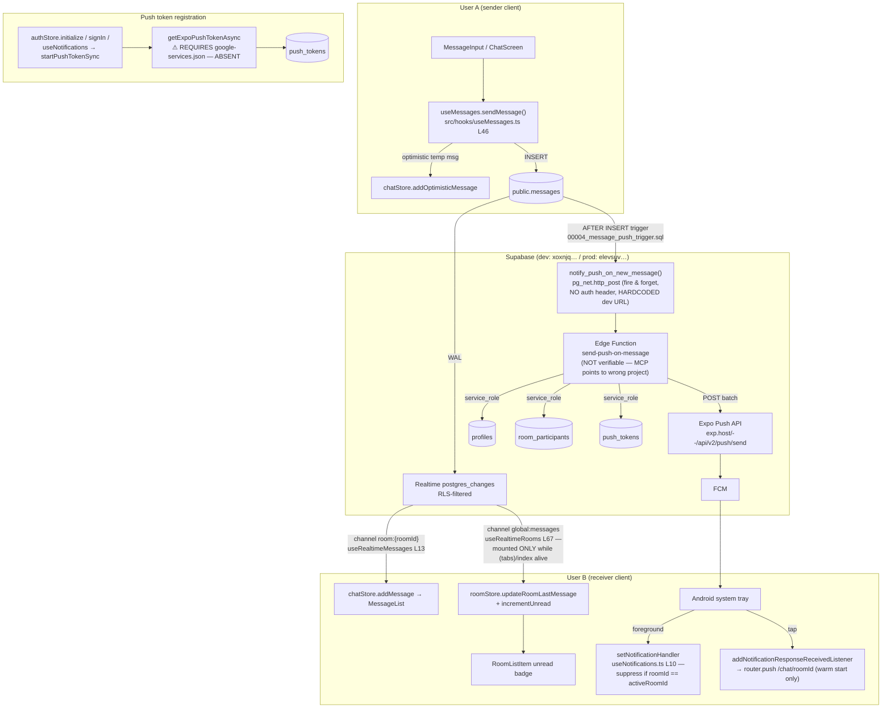

# Notification System Audit — Talo

> Date: 2026-07-28 · Scope: end-to-end notification flow (in-app realtime badges + Android push)
> Status: **REPORT ONLY — no code was modified.**

---

## 1. Current Architecture

Reality check: this app is **not** Next.js/Socket.IO. There is no custom WebSocket server and no `notifications` table. There are **two independent notification channels**:

1. **In-app (foreground)** — Supabase Realtime `postgres_changes` → Zustand stores → unread badge in the room list.
2. **Push (background/killed)** — Postgres trigger → `pg_net` HTTP POST → Edge Function `send-push-on-message` → Expo Push API → FCM → Android device.

There is no SSE, no presence-based delivery decision, no notification persistence, and push is **Android-only by design** (`src/services/notificationService.ts` L37–43).



---

## 2. Problems Found — ranked by probability of being *the* reason push "doesn't work"

### 🔴 P1 — CRITICAL: FCM client config is missing from the build entirely

- **Evidence:**
  - `app.json` L13–24: `android` block has **no `googleServicesFile`** entry.
  - `.gitignore` L54: `/android` is **gitignored** → EAS builds use CNG/prebuild from `app.json` only. The committed local `android/` folder is irrelevant to EAS and contains no `google-services.json` either (verified: 0 matches for `google-services|firebase` under `android/`).
- **Why it kills the whole feature:** without `google-services.json` compiled into the APK, Firebase never initializes on-device, `Notifications.getExpoPushTokenAsync()` (`src/services/notificationService.ts` L78–80) throws, **no token is ever written to `push_tokens`**, and the Edge Function finds zero recipients. The code even anticipates this failure — L87–91 returns *"FCM chưa cấu hình đúng trên bản build"*. If you've seen that message in Settings, this is confirmed.
- **Probability: ~90%.** This alone makes every downstream step moot.
- **Fix:** add to `app.json`: `"android": { "googleServicesFile": "./google-services.json", ... }`, place the file from Firebase Console at repo root (gitignore it if desired — EAS supports file env vars), upload the **FCM V1 service account key** via `eas credentials --platform android`, then **rebuild** the APK. Config changes require a new native build.

### 🔴 P2 — CRITICAL: Trigger → Edge Function call has no Authorization header (silent 401), and deployment state is unverifiable

- **Evidence:** `supabase/migrations/00004_message_push_trigger.sql` L19–27 — `net.http_post` sends only `Content-Type`. If `send-push-on-message` was deployed **without** `--no-verify-jwt` (the default is verify-JWT ON), every invocation is rejected with 401. `pg_net` is fire-and-forget (`PERFORM`), so **failures are invisible**: the message insert succeeds, the trigger "succeeds", and nothing happens.
- **Verification blocked:** the Supabase MCP configured in this workspace points to an **unrelated project** (`cbwikevombpvoxkudoyb` — a restaurant DB; `list_edge_functions` returned `[]` and `public.messages` does not exist there). I could not confirm whether the function/trigger/migrations are actually deployed on `xoxnjqgumfhzwturtfhz` (dev) or `elevsuvbbittizjxrfll` (prod). **Fix the MCP project ref, then run the verification SQL in §6.**
- **Probability: ~60%** (independent of P1 — both must be healthy).
- **Fix:** store the service key via Vault or pass `Authorization: Bearer <anon or service key>` header from the trigger (read from Vault, not hardcoded), keep verify-JWT ON, and validate the caller inside the function. See P8 — deploying with `--no-verify-jwt` and no shared secret is the insecure alternative.

### 🔴 P3 — CRITICAL (prod only): trigger hardcodes the dev project URL

- **Evidence:** `00004_message_push_trigger.sql` L14: `project_url := 'https://xoxnjqgumfhzwturtfhz.supabase.co'`. `eas.json` L31 shows production uses `elevsuvbbittizjxrfll`. If this migration was applied to prod as-is, prod messages POST to the **dev** function, which reads **dev** `push_tokens` → prod users never get push.
- **Fix:** derive the URL per-project (e.g., store in Vault/`app_settings` table, or use a Supabase **Database Webhook** instead of a hand-rolled trigger — it handles URL + auth natively; your own `ANDROID_PUSH_SETUP.txt` §3b already suggests this).

### 🟠 P4 — HIGH: notification tap does nothing on cold start

- **Evidence:** `src/hooks/useNotifications.ts` L40–55 only registers `addNotificationResponseReceivedListener`. When the app was **killed** and launched by tapping the notification, the response is delivered **before** React mounts the listener → deep link lost, app opens on the room list. Expo requires `Notifications.getLastNotificationResponseAsync()` (or `useLastNotificationResponse`) for this case, plus deferring `router.push` until the navigator + auth are ready (`AuthGate` may `router.replace` to `(tabs)` at L30–32 of `app/_layout.tsx`, clobbering the push).
- **Fix:** on mount, read the last notification response, stash `roomId` (e.g., in a ref/store), and navigate after `initialized && session` is true.

### 🟠 P5 — HIGH: in-app realtime silently dies — no reconnect, no error handling, no resync

- **Evidence:** all three subscriptions call bare `.subscribe()` with no status callback and no recovery:
  - `src/hooks/useRealtime.ts` L52 (`room:${roomId}`), L106 (`global:messages`)
  - `src/hooks/useTypingIndicator.ts` L45
  On Android, backgrounding the app for a few minutes tears down the socket; on `CHANNEL_ERROR`/`TIMED_OUT` nothing resubscribes and nothing refetches missed rows. Result: **unread badges and live messages stop updating until app restart** — the classic "notifications worked, then stopped".
- **Fix:** `subscribe((status) => …)` — on error/timeout, remove + recreate channel; add an `AppState` listener that on `active` refetches (`fetchRooms`, `fetchMessages`) and resubscribes. Consider `supabase.realtime.setAuth()` refresh awareness.

### 🟠 P6 — HIGH: `global:messages` channel is torn down and rebuilt constantly (lost-event windows, missed badges)

- **Evidence:** `src/hooks/useRealtime.ts` L111–117 — effect deps include `activeRoomId` and the `user` **object**:
  - Every chat open/close flips `activeRoomId` (`useMessages.ts` L30/L39) → unsubscribe + resubscribe of the global channel; INSERTs landing in that gap are lost (badge never increments).
  - `user` gets a new object identity on every auth event incl. hourly `TOKEN_REFRESHED` (`authStore.ts` L54–55) → periodic churn of **all** realtime effects (`useRealtime.ts` L67, `useMessages.ts` L44, `useTypingIndicator.ts` L54).
  - Additionally, the hook lives in `useRooms` → only mounted while `(tabs)/index` is alive (`src/hooks/useRooms.ts` L10). Deep-linking straight into `/chat/[roomId]` from a push means no global listener at all.
- **Fix:** read `activeRoomId` inside the callback via `useChatStore.getState().activeRoomId` (same pattern already used in `useNotifications.ts` L15) and depend on `user?.id` (string) instead of `user`. Mount the global listener once at `AuthGate` level, not per-screen.

### 🟠 P7 — HIGH (security/privacy): push tokens leak across accounts after sign-out

- **Evidence:** `pushTokenService.ts` L4 keeps `currentToken` in a **module-level variable** — wiped on every app restart. `authStore.signOut` L121 calls `removeCurrentToken()`, which is a no-op when `currentToken === null` (L73–76). Flow: login → token saved → kill app → reopen → sign out → **token row for user A stays in DB** → user A's messages keep pushing to this device, even after user B logs in on it.
- **Also:** `signOut` never calls `chatStore.reset()` / `roomStore.reset()` → user B briefly sees user A's rooms/messages.
- **Fix:** persist the token (SecureStore) or delete by `token` value fetched via `getExpoPushTokenAsync()` at sign-out; call both store `reset()`s in `signOut`.

### 🟠 P8 — HIGH (security): Edge Function accepts unauthenticated, unvalidated payloads

- **Evidence:** `supabase/functions/send-push-on-message/index.ts` L84–100 — no auth check, and `normalizePayload` (L64–82) trusts any `record`. If deployed with `--no-verify-jwt` (as `ANDROID_PUSH_SETUP.txt` L10 instructs), **anyone with the URL can forge pushes**: spoof `sender_id`/`room_id`/`content` and spam every participant of a room. No rate limiting.
- **Fix:** require a shared secret header (set via `supabase secrets set`, sent by the trigger), verify `record.id` actually exists in `messages` (one indexed lookup with the service client), and reject otherwise.

### 🟡 P9 — MEDIUM: duplicate message rendered after send (optimistic race)

- **Evidence:** `useMessages.ts` L64–76 — realtime INSERT (`useRealtime.ts` L24–26) frequently arrives **before** the awaited `.insert().select()` returns. Sequence: `addMessage(real)` (passes dedupe, temp id ≠ real id) → then `replaceOptimisticMessage(tempId, real)` (`chatStore.ts` L112–124, **no dedupe**) → the list now holds the real message **twice with the same id** → duplicate rows / FlashList key collisions.
- **Fix:** in `replaceOptimisticMessage`, if a message with `message.id` already exists, just drop the temp one.

### 🟡 P10 — MEDIUM: server-side `unread_count` counts your own messages

- **Evidence:** `00001_initial_schema.sql` L191–193 — `COUNT(m.id) FILTER (WHERE m.created_at > rp.last_read_at)` has **no `m.sender_id <> p_user_id`** filter. Symptoms: messages you sent from device A show as "unread" on device B; if the un-awaited, un-caught `updateLastRead` (`useMessages.ts` L35, L41) fails, even your own just-sent messages show as unread on the same device. This diverges from the client rule (`useRealtime.ts` L88 excludes own messages) → badge flip-flops between local increment and server refetch.
- **Fix:** add `AND m.sender_id <> p_user_id` to the FILTER in a new migration.

### 🟡 P11 — MEDIUM: `device_id = Device.modelName` — collisions delete sibling tokens

- **Evidence:** `notificationService.ts` L98–103 passes `Device.modelName` as `device_id`; `pushTokenService.upsertToken` L29–35 deletes all rows matching `(user_id, device_id)` first. Two devices of the same model (e.g., two Pixel 8s) on one account → each registration deletes the other's token → only the most recently opened device gets push.
- **Fix:** use a per-install UUID (generate once, store in SecureStore) as `device_id`.

### 🟡 P12 — MEDIUM: Expo push tickets/receipts ignored → dead tokens accumulate

- **Evidence:** `send-push-on-message/index.ts` L45–62 — response body (ticket-level `DeviceNotRegistered`, throttling errors) is discarded; no receipt follow-up; no chunking at 100 messages (fine at current scale, still a latent bug).
- **Fix:** parse tickets; delete `push_tokens` rows on `DeviceNotRegistered`.

### 🟡 P13 — MEDIUM: `onAuthStateChange` awaits Supabase calls inside the callback

- **Evidence:** `authStore.ts` L54–64 — `await get().fetchProfile()` inside the callback. This is the documented supabase-js deadlock pattern; it can stall token refresh, which then kills Realtime auth → downstream "notifications stopped" reports.
- **Fix:** wrap the body in `setTimeout(…, 0)` or fire-and-forget (`void`).

### 🔵 P14 — LOW: room list preview loses the sender name on live update

- **Evidence:** `useRealtime.ts` L81–86 passes `null` for `senderName` → `RoomListItem.tsx` L62–64 drops the `"Name: "` prefix until the next full refetch.

### 🔵 P15 — LOW: triple push registration on login

- **Evidence:** the same `registerPushNotificationsForUser` runs from `authStore.initialize` (L51, L59), `authStore.signIn` (L112), and `useNotifications → startPushTokenSync` (`useNotifications.ts` L37) — plus again on **every** foreground (`notificationService.ts` L124–128), causing a delete+insert DB write pair each time. Harmless w.r.t. the `UNIQUE(user_id, token)` constraint, but wasteful and noisy.

---

## 3. Root Causes (condensed)

| # | Root cause | Layer |
|---|-----------|-------|
| 1 | FCM never configured in the EAS-built binary (no `googleServicesFile`) | Build/native |
| 2 | Trigger→Function auth mismatch + silent `pg_net` failures + hardcoded dev URL | Backend |
| 3 | Deployment state never verified (MCP bound to wrong project; no observability) | Ops |
| 4 | Realtime lifecycle treated as fire-and-forget: no reconnect, unstable effect deps, per-screen mounting | Client realtime |
| 5 | Token lifecycle state kept in volatile memory; identity of device conflated with model name | Client push |
| 6 | Unread accounting split between client heuristic and server SQL that disagree | Data |

## 4. Severity Summary

| Severity | Issues |
|----------|--------|
| Critical | P1, P2, P3 |
| High | P4, P5, P6, P7, P8 |
| Medium | P9, P10, P11, P12, P13 |
| Low | P14, P15 |

---

## 5. Messenger-UX Gap Analysis (§7 of your brief)

| Behavior | Status |
|---|---|
| Unread badge per room | ✅ (but racy — P5/P6/P10) |
| App-icon / tab-bar total badge | ❌ missing (no `Tabs.Screen` `tabBarBadge`, no `setBadgeCountAsync`) |
| In-app banner while chat closed, app foreground | ⚠️ only via FCM banner (needs P1); no in-app toast fallback |
| Suppress banner while that chat is open | ✅ (`useNotifications.ts` L10–26) |
| Notification tap → open room (warm) | ✅ |
| Notification tap → open room (cold start) | ❌ P4 |
| Multiple devices | ⚠️ P10/P11 |
| Multiple tabs (web) | ❌ push unsupported on web by design; realtime per-tab OK |
| Background tab / minimized browser | ❌ no web push |
| Offline → reconnect resync | ❌ P5 |
| Read-state sync across devices | ⚠️ accidental only (room_participants UPDATE triggers full refetch — see §Perf) |
| iOS push | ❌ by design (Android-only) |
| Message grouping / reply-from-notification | ❌ not implemented |

## Performance findings (§9)

1. **Refetch storm:** `updateLastRead` UPDATEs `room_participants` (on every room enter *and* leave — `useMessages.ts` L35/41), the table is in the realtime publication (`00001` L217), and `useRealtimeRooms` refetches **all** rooms on *any* participant event (`useRealtime.ts` L95–105). Every room open by any member of any of your rooms ⇒ full `get_user_rooms` RPC for every online member. O(members²) chatter.
2. **`get_user_rooms` scans all messages per room:** `00001` L204 `LEFT JOIN public.messages m` + `COUNT FILTER` aggregates the **entire message history** of every room on every call. Gets slower forever. Fix: replace with a lateral `COUNT(*) WHERE created_at > last_read_at AND sender_id <> p_user_id` subquery (uses `idx_messages_room_created`).
3. Channel churn (P6) = unnecessary websocket JOIN/LEAVE per navigation.
4. Registration runs 3–4× per login + every foreground (P15).

## Security findings (§10)

- Realtime `postgres_changes` is RLS-enforced ✅ (policies in `00001`/`00002` are sound; recursion already fixed).
- `messages_insert` prevents sender spoofing ✅ (`00001` L126–133).
- Edge Function: unauthenticated + unvalidated ❌ (P8).
- Sign-out token leakage ❌ (P7).
- `push_tokens` RLS is owner-only ✅ (`00003` L19–29).
- Anon keys in `eas.json` are fine (public by design); `service_role` only in Edge Function env ✅.

---

## 6. Recommended Fix Plan (in order — pending your approval)

### Phase 0 — Verify before touching code (30 min, no risk)
1. Repoint the Supabase MCP (or CLI) to `xoxnjqgumfhzwturtfhz`, then run:
   ```sql
   -- trigger installed & enabled?
   SELECT tgname, tgenabled FROM pg_trigger
   WHERE tgrelid = 'public.messages'::regclass AND NOT tgisinternal;
   -- did pg_net calls fail? (silent 401/404 evidence)
   SELECT status_code, error_msg, created FROM net._http_response
   ORDER BY created DESC LIMIT 20;
   -- are any tokens registered at all?
   SELECT platform, count(*) FROM push_tokens GROUP BY platform;
   ```
2. `supabase functions list` — confirm `send-push-on-message` exists and its verify-JWT setting.
3. In the app's Settings screen, tap the push-registration button and read the surfaced error string — it will distinguish P1 (FCM message) from permission/session issues.

### Phase 1 — Critical (push pipeline)
- **P1:** add `googleServicesFile` to `app.json`, upload FCM V1 key to EAS, rebuild preview APK.
- **P2/P3:** migration `00005`: rewrite the trigger to read URL + secret from Vault (or replace trigger with a Dashboard **Database Webhook**); add secret check in the Edge Function; redeploy with JWT verification consistent with the chosen scheme.
- **P8:** same migration/deploy — payload validation (`record.id` must exist in `messages`).

### Phase 2 — High (in-app reliability)
- **P5/P6:** stabilize effect deps (`user?.id`; `getState()` for `activeRoomId`), move `useRealtimeRooms` to `AuthGate`, add subscribe-status handling + AppState resync.
- **P4:** cold-start `getLastNotificationResponseAsync` + deferred navigation.
- **P7:** persist push token; delete on sign-out by value; reset chat/room stores on sign-out.

### Phase 3 — Medium
- **P9** dedupe in `replaceOptimisticMessage`; **P10** migration fixing `get_user_rooms` (also fixes perf item 2); **P11** install-UUID device id; **P12** ticket handling; **P13** de-async `onAuthStateChange`.

### Potential side effects
- Rebuilding with FCM changes the binary — existing installs must update.
- Replacing the trigger requires the Edge Function redeploy **first** (else brief 404 window; `pg_net` failures are non-blocking, messages unaffected).
- `get_user_rooms` change alters unread semantics (own messages no longer counted) — client `incrementUnread` already matches, so badges become *more* consistent, not less.
- Moving `useRealtimeRooms` to root: ensure single mount (remove from `useRooms`) to avoid double subscriptions.

### Migration plan
1. Deploy new Edge Function version (backward-compatible payload).
2. Apply `00005` (trigger + `get_user_rooms` fix) on **dev**, verify with SQL above + 2-device test.
3. Ship client Phase 2/3 changes in the same EAS build as P1.
4. Repeat migration on **prod** (`elevsuvbbittizjxrfll`) with the prod URL/secret.
5. Regenerate `src/types/database.ts` if any schema surface changed.

### Testing checklist
- [ ] Fresh install → login → row appears in `push_tokens` (platform=android)
- [ ] Device B killed → A sends text → B gets banner with sender name + preview; tap opens the room (cold start)
- [ ] Same, app in background / foreground on other screen
- [ ] B inside the room → no banner, message renders live
- [ ] Image message → "Đã gửi ảnh" preview
- [ ] Group room: all members except sender notified once
- [ ] Airplane-mode 2 min → reconnect → badges and room list catch up without restart
- [ ] Sign out on device → send message to that account → **no** push arrives
- [ ] Two same-model devices, one account → both receive push
- [ ] Sender sees exactly one copy of a fast-typed message (no dup ids)
- [ ] `net._http_response` shows 200s only

### Regression checklist
- [ ] Send / edit / delete / reply / typing indicator unchanged
- [ ] Unread badge clears on room open and stays cleared after refetch
- [ ] Room list ordering by last message intact
- [ ] Login/logout/reset-password flows unaffected
- [ ] Web build still compiles (push code paths guarded by `Platform.OS`)
- [ ] No RLS advisor warnings introduced (`get_advisors`) 
